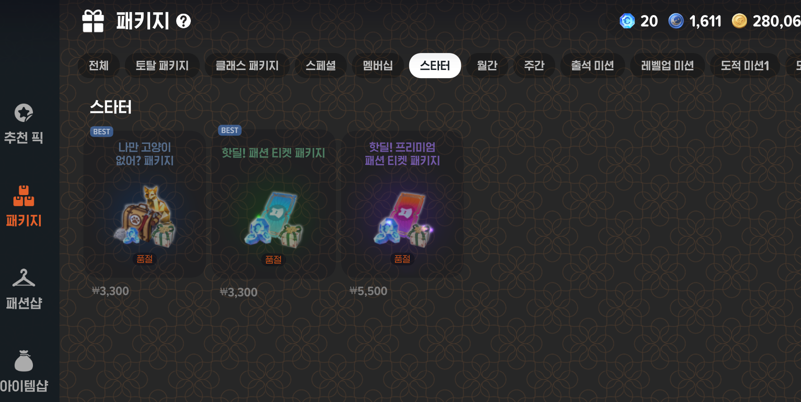
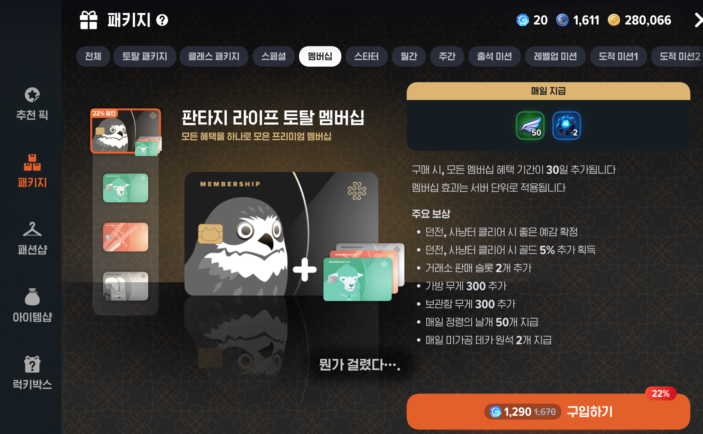
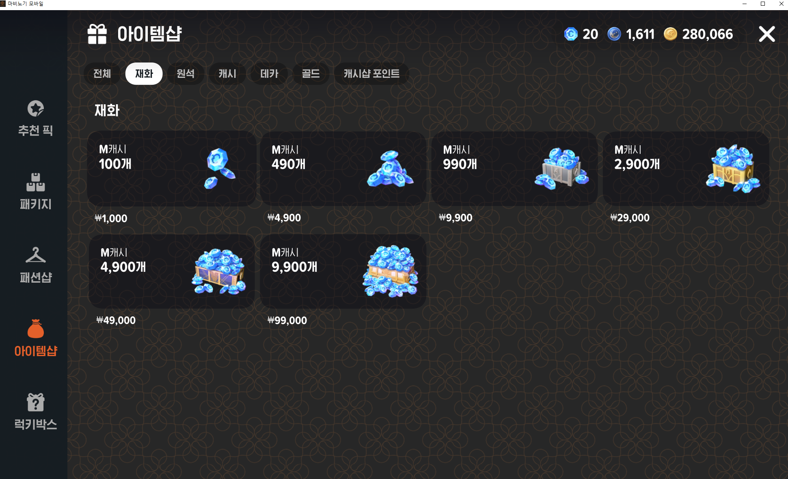
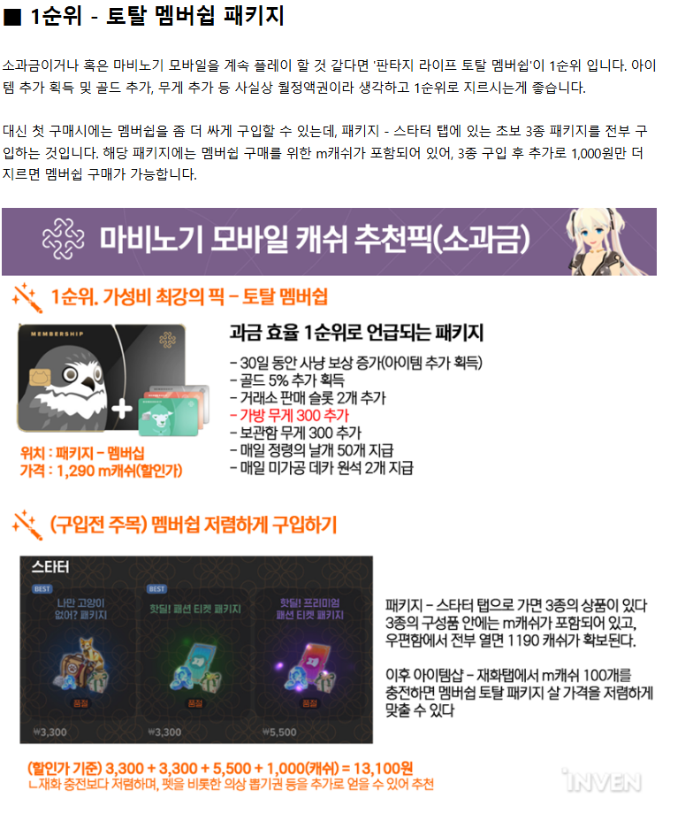

# 📦 마비노기 모바일 BM 분석: 패키지 (스타터팩 + 멤버십)

실제 비과금 유저 나 자신의 구매 경험을 바탕으로 설득 설계, 반복 접속 유도, 가격 구조 연계를 중심으로 분석을 하였으며, 리텐션 중심 BM의 효과성과 UX 설계를 도출 해봤다

## 1. 과금 유도 구조 개요

마비노기 모바일은 사용자 심리와 플레이 흐름에 맞춘  
**단계별 패키지 구매 유도 구조**를 통해 자연스럽고 거부감 없는 과금 전환을 설계하고 있다.  
그 대표적인 구조가 바로 **스타터팩 → M캐시 확보 → 멤버십 구매**의 흐름이다.

---

## 2. 스타터팩 구성 및 유도 요소

| 상품명 | 가격 | 구성 | 특징 |
|--------|------|------|------|
| 나만 고양이 없어? 패키지 | ₩3,300 | 330M캐시, 레어 고양이 펫, 펫 먹이, 은동전 상자 | 감성 + 실용성 결합 |
| 핫딜! 패션 티켓 패키지 | ₩3,300 | 330M캐시, 패션 티켓 10장 | 치장 요소 유도 |
| 프리미엄 패션 티켓 패키지 | ₩5,500 | 550M캐시, 프리미엄 패션 티켓 10장 | 고급 희귀도 제공 |

- 총 1,210M캐시 확보 가능
- 이 캐시로 멤버십 구매의 **발판** 제공
- 펫/치장 요소는 감성 자극, 은동전은 실질적 피로도 해소
-  펫, 말 > 능력치, 이동 수단 실용성 상승 / 감성요소
- 패션 티켓 > 외형 커스터마이징 욕구 충족

---

## 3. 멤버십 카드 4종 구성

| 이름 | 가격 | 주요 혜택 |
|------|------|------------|
| **토탈 멤버십** | 1,290M캐시 | 은동전, 가방/보관함 무게 +300, 던전 보상, 거래소 슬롯 추가 |
| **라이프 멤버십** | 490M캐시 | 채집 2배 보상, 생활 경험치/속도 증가, 정령의 날개 |
| **던전크롤러 멤버십** | 490M캐시 | 회복 아이템, 은동전 제공, 전투 효율 강화 |
| **모험가 멤버십** | 690M캐시 | 은동전 10개, 수리비 할인, 펫 경험치, 퀘스트 보상 증가 |

- 은동전 부족 = 콘텐츠 제한 → 구매 설득 요소
- 인벤 무게 제한 = 반복 콘텐츠 피로도 증가 → 해소
- 정액제 구성 → 일일 보상 습관화 + 리텐션 상승
- 은동전 > 콘텐츠 진행 필수 자원 요소 (피로도)
- 가방, 보관함 > 반복 콘텐츠 후 제공되는 아이템 보관 편의성 향상
- 멤버십 일일 보상 > 접속 루틴 형성

---

## 4. 단계별 유도 흐름 요약
구매 흐름 설계 도식화

> 스타터팩 구매(₩3,300 x2 + ₩5,500) → 1,210 M캐시 확보  
> + ₩1,000 현금 충전 → 1,310 M캐시 완성  
> → 토탈 멤버십 구매 가능 (1,290M캐시)

🎯 결과적으로 "단돈 천원 추가로 프리미엄 멤버십까지"라는 메시지를 유도함  
→ 거부감 없이 처음부터 **패키지 + 정액 멤버십**까지 과금 유도 가능

---

## 5. 실제 사용자 경험 기반 분석

정재우는 RPG에서 소과금조차 드물게 하는 사용자지만,  
이번 구조에서는 다음과 같은 요소들에 설득되어 구매를 진행함:

- 단순 치장보다 **실질적 불편 해소**(은동전, 무게)
- 펫, 말 등의 **희소 자산 제공**
- 가격 대비 가성비가 뚜렷하고 **논리적 정당성 확보**
- 구성 간의 연계성 (스타터팩 → 멤버십 흐름)

---

## 6. 게임 플레이에 미치는 영향

| 항목 | 영향 |
|------|------|
| 진행 속도 | 은동전 지급 → 던전/사냥 지속 가능 |
| 루틴 강화 | 일일 보상 → 접속 유지 (리텐션 상승) |
| 반복 콘텐츠 효율 | 가방/보관함 무게 증가 → 피로도 감소 |
| 구매 루프 | 정액제 종료 시 재구매 욕구 발생 (심리 루프 설계) |

ex)
던전 진입 > 은동전 제한으로 인한 진입 불가 > 은동전 제공으로 추가 던전 진입 가능

가방/보관한 > 필요 아이템이 가득찰 시 이동속도 저하/판매/버리기에 대한 고민 > 여유로운 수납 가능(쾌적함)

→ 구조적으로 잘 설계된 BM임을 체감
---

## 🧠 결론

마비노기 모바일의 스타터팩+멤버십 패키지 구조는  
유저의 심리를 이해한 정교한 BM 설계이다.

- ‘싼데 쓸모 있다’는 판단을 유도하여 진입 장벽 최소화
- 실질적 게임 편의 요소와 감성 요소를 적절히 결합
- 반복 루틴과 연결되어 **지속적인 과금 유도 루프**를 형성

정재우(나)처럼 비과금 성향의 유저조차  
"사야 될 이유가 납득되는 구조"로 인해 **구매로 전환되었다는 점**이  
이 BM의 설득력을 잘 보여준다.

---
ChatGPT로 정리 하기 전 내용

사용자의 심리와 플레이 흐름에 맞춘  단계별 패키지 구매 유도 방식으로 설계되어 있다
직접 패키지 부분을 이용한 요소 중에 스타터팩 + 멤버십 구성은 초반 플레이어에게 자연스럽게 과금 경험을 유도하면서도 거부감 없이 정당성을 제공하는 대표적인 BM 구조로 보인다

스타터 팩 3종
나만 고양이 없어? 패키지 / 3,300원 / 330M 캐쉬, 황금 고양이상(펫 먹이) 1개, 고양이 단짝 캐리어(레어 등급 고양이 펫 선택), 작은 은동전 상자
핫딜! 패션 티켓 패키지 / 3,300원 / 330M 캐쉬, 패션 티켓 10개
핫딜! 프리미엄 패션 티켓 패키지 / 5,500원 / 550M캐쉬, 프리미엄 패션 티켓 10개

레어 등급 고양이는 최대 15레벨 까지 오를 수 있고 레벨이 오르면 동행 능력치도 성장
펫의 빠른 레벨업은 펫의 먹이 주기를 하면 된다 > 펫먹이는 최소1개 ~ 최대110개까지 가능하고 포만감은 최대 100으로 100초과 시 저장한 포만감으로 바뀜

패션 티켓과 프리머임 패션 티켓은 럭키박스에서 사용가능
자신만의 패션 센스를 발휘해 볼 기회가 여기에!
사용하면 확률에 따라 고급~엘리트 희귀도의 패션 장비를 1개 얻을 수 있고
프리미엄 패션 티켓은 고급~에픽 희귀도의 패션 장비를 1개 얻을 수 있다.

패션 장비는 염색약을 사용하여 염색을 할 수 있고 염색파트는 총 6개
패션 장비 효과가 있으며, 착용한 장비의 방어력이 증가하고, 착용한 장비의 내구도 소비를 감소시키고, 매력이 증가한다

총 1210M 캐쉬를 얻을 수 있고 이 것을 토대로 거부감 없이 멤버쉽을 구매하기 위한 발판 요소가 된다

토탈 멤버쉽 카드 4종
판타지 라이프 토탈 멤버쉽 / 1290M 캐쉬 1670M캐쉬에서 22%할인 가격으로 제공 /아래의 3종 멤버쉽 이용 가능 / 던전,사냥터 클리어시 추가보상, 거래소 판매 슬롯 2개 추가, 가방 무게 300추가, 보관함 무게 300추가 등
라이프 멤버쉽(생활) / 490M 캐쉬 / 레어등급음식제공, 멤버쉽 전용 아르바이트 퀘스트 추가, 생활 관련 속도, 추가 보상 제공
던전크롤러 멤버쉽(전투) / 490M 캐쉬 / 부활 아이템 제공 / 회복물약제공 / 던전, 사냥터를 이용 할 수 있는 은동전 제공
모험가 멤버쉽(교역) / 690M 캐쉬 / 전용 일일,주간 퀘스트 추가 / 펫먹이,은동전 제공 /장비 수리비 할인 등

100M 캐쉬를 얻기 위한 현금은 1000원
스타터팩 3종을 구매 후 1000원이라는 금액을 투자하면
판타지 라이프 토탈 멤버쉽을 구매할 수 있다.

단계적 유도 흐름 방식 구조는
스타터팩을 구매후 > M캐쉬를 확보하고 > 멤버쉽 구매가 가능하게 구성 되어있고
이것으로 사용자의 심리 유도를 설계 한 것으로 분석이 되며,
만원 초반대의 상품으로 과금 장벽을 최소화 시켜 거부감을 줄여 정당성을 늘린 것으로 파악된다
그리고 게임을 진행하기 위한 피로도에 직결되는 은동전 부족이나, 가방의 무게, 보관함 무게의 대한 한계를 주어 불편함을 해소 시키게 해주었고
덤으로 펫이나/탈 수 있는 말/치장으로 부담 없이 가질 수 있게 설득에 힘을 가해준 것으로 파악된다

저 또한 RPG에서 소과금도 잘 안하는 편이지만 이런 구조로 인해 설득 당한 것으로 보아
구조가 잘 짜여 있는 BM으로 보인다

게임 플레이에 미치는 영향
게임 진행속도 > 은동전을 지급함으로서 다양한 콘텐츠를 지속해서 즐기기 힘든 부분을 해소시켜준다
가방/보관함 무게 증가 > 반복적으로 콘텐츠를 즐기다 보면 무게가 한계에 도달하는 부분들을 해소시켜준다
일일 보상 지급 > 멤버쉽 보상으로 인해 게임에 접속하기 위한 리텐션 레이트를 증가시켜준다
추후 구매 유도 > 가볍게 과금의 문턱을 허물어준 것을 기반으로 기간이 만료시 필요성을 더 느끼게 해주어 재구매 요소까지 고려 하게 해준다.
