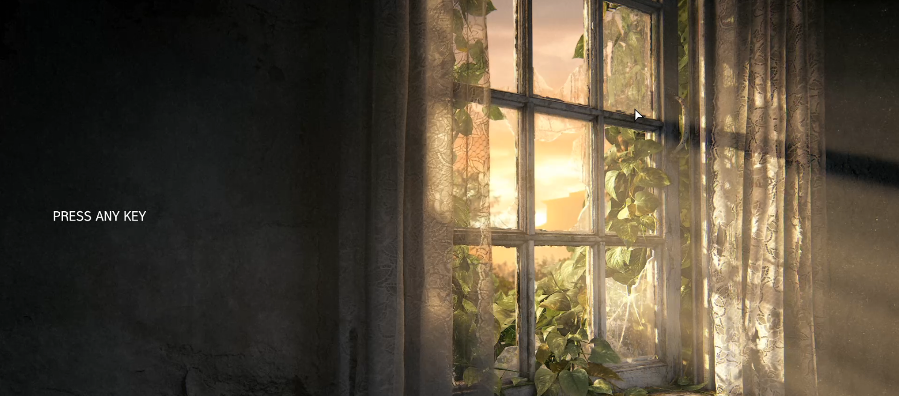
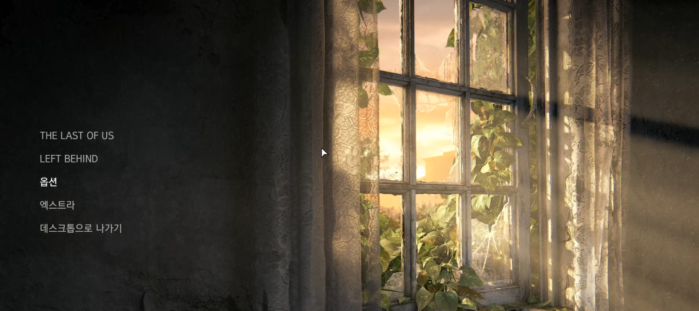
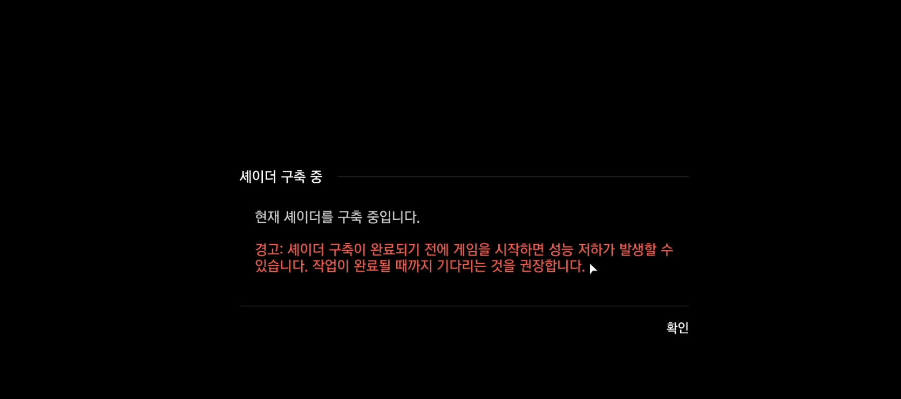
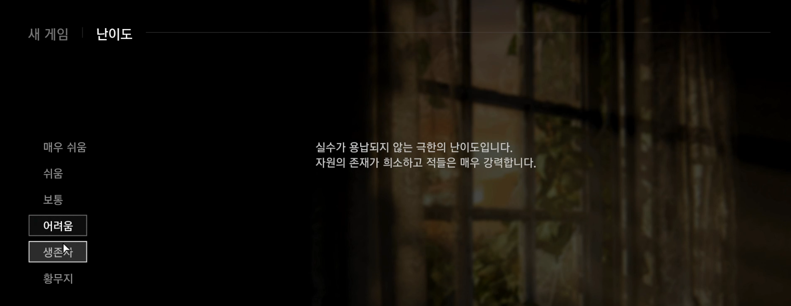
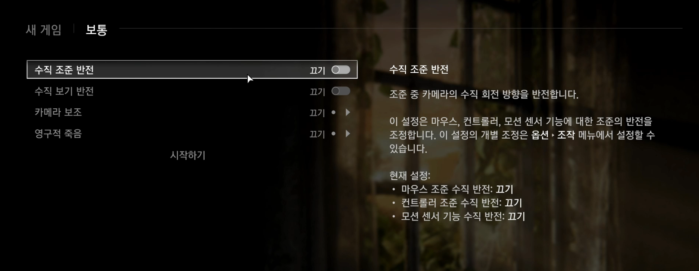
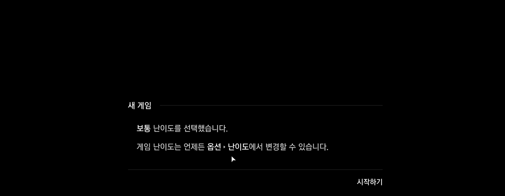

## The Last of Us Part I - 오프닝 UX/시스템 기획 해체 분석
---

---

## 분석 대상

구간: 게임 실행 ~ 첫 컷신 진입 전까지

분석 목적: 게임 진입 전 플레이어의 감정, 몰입, 시스템 설정 흐름이 어떻게 설계되었는지 구조적으로 파악하고, UX/시스템 기획적 시선으로 해석함

---

## 기획 의도 추정

플레이어에게 서서히 게임 세계관에 몰입할 수 있는 환경을 제공

HUD 없음, 정적인 이미지 + BGM 구성으로 감정 몰입 유도

자기 결정 기반 난이도 설계로 생존 게임의 긴장감을 사전에 전달

---

## 전체 흐름 요약

게임 실행 및 PRESS ANY KEY 화면

백그라운드: 정적인 애니메이션 이미지

BGM: 스산한 분위기의 서정적 음악

메인 메뉴 구성

메인 스토리 선택 → 셰이더 경고 → 난이도 선택 → 세부 설정 → 게임 진입

---

## 메인 메뉴 구성

선택지: THE LAST OF US / LEFT BEHIND / 옵션 / 엑스트라 / 종료

LEFT BEHIND는 스토리 완료 후 진행 가능

---

- 메인 스토리 선택 → 셰이더 경고

"셰이더 구축 중입니다" → 최적화 필요 경고 안내

- 새 게임 선택 → 난이도 선택 (6단계)

매우 쉬움 ~ 황무지 모드까지 세분화

- 각 난이도에 상세 설명 존재

"황무지" 난이도는 듣기모드/HUD 등 기능 제한 포함

--- 

세부 설정 옵션 등장

- 수직 조준/보기 반전

- 카메라 보조

- 영구적 죽음 (게임 전체/액트/챕터 단위)

- 수동 저장 불가 경고 포함

---

로딩 진입 & 연출

- 검은 배경 위 애니메이션: 방울 또는 DNA 형태 분사 연출

- Sony Interactive Entertainment Presents 문구이 후 게임 진입

---

## 시스템/기능 요소 분석

| 항목 | 설명 |
|------|------|
| **UI 구성** | 메뉴 구조는 중앙 정렬, 시각적으로 심플한 강조 스타일 |
| **난이도 세분화** | 6단계 + "영구적 죽음" 설정으로 자기결정 기반 난이도 선택 유도 |
| **사용자 친화 설정** | 조준/시야 반전, 카메라 보조 등 UX 진입 장벽 완화 기능 제공 |
| **저장 제한 경고** | 시스템적으로 긴장감 부여, HUD 숨김과 더불어 몰입감 강화 |
| **시각 연출** | 정적인 배경 + 제한된 UI → 시네마틱 몰입 유도 |

---

## UX 관찰 & 구조적 해석

- PRESS ANY KEY 화면

조작 없이 기다리는 화면 → 사용자의 심리적 몰입 유도

- BGM과 배경이 감정을 준비시키는 도입 장치

난이도 선택 & 설명

- 상세 설명이 붙어 있어 유저의 자기결정과 예측 가능성 제공

- "황무지" 난이도는 기능 제한으로 리얼리즘 강조 → 콘셉트 강화

카메라 보조, 조준 반전 등

- 컨트롤러/모션센서 포함한 세밀한 입력 설정 → 배려형 설계

영구적 죽음 모드

- "죽으면 초기화" 구조를 액트/챕터별로 나눈 설계는
난이도 밸런스와 리스크 조절을 섬세하게 고려한 UX 설계

---
## 재기획 제안 (라오어 오프닝 UX 개선 제안)

난이도 선택 시, 텍스트만으로 설명하기보다 간략한 영상/이미지 비교 자료를 함께 제공하면 사용자가 실제 난이도를 직관적으로 파악하는 데 도움이 될 것 같음

'영구적 죽음' 설정은 게임 시작 전에만 고를 수 있도록 설계돼 있어 신중한 선택을 유도하려는 의도는 명확하지만, 초심자 입장에서 긴장감을 줄 수 있음

따라서, 튜토리얼이 끝난 후 한 번 더 난이도나 영구적 죽음 관련 설정을 변경할 기회를 제공하는 방식도 고려 가능하다고 판단함

## 기획 해석 요약

진입 장면은 전투도, 컷신도 없지만 강력한 UX 시나리오임

플레이어에게 직접 선택하게 하는 구조(난이도/옵션)로 책임감을 부여하며, 동시에

HUD 최소화와 조작 제한으로 몰입을 유도함

모든 설정 요소가 게임 콘셉트(생존/긴장감/현실감)과 맞닿아 있음

---